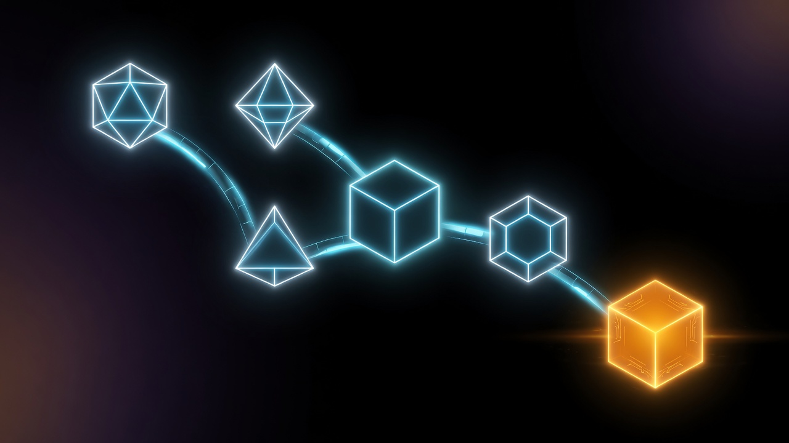
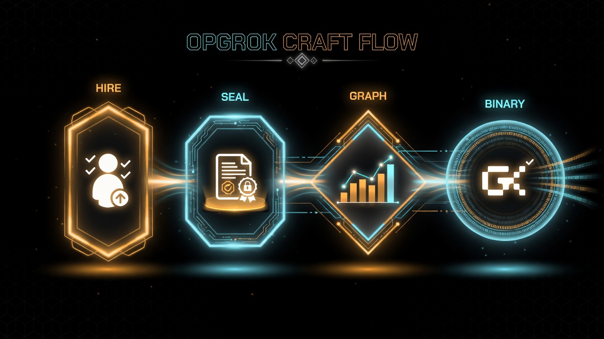

# OPGROK

**Build a team of specialized Grok agents for any goal — then ship it as one reusable binary.**


<p align="center">
  
</p>

```text
@opgrok build a marketing site with hero, pricing, and wireframes
```

That one line is the product.

---

## What OPGROK is

OPGROK is a **framework for Grok itself**.

It does not replace Grok. It multiplies Grok by:

1. **Hiring SuperGroks** — 150 specialist agents (25 categories x 6 roles) + navigators + core skills
2. **Sealing a plan with Leslie** — falsifiable Winning Condition (spec only, no implementation code)
3. **Building a work tree** — n8n-style graph of agents (IPO + OODA per node)
4. **Packaging one harness** — **one binary** + **one README** under `core/binaries/`
5. **Running the graph** — each node injects its skill and calls the **xAI Grok API**
6. **Surfacing a result** — `OPGROK_RESULT` from the sink (usually a judge SuperGrok)

Think of it as: *Grok hires Grok specialists, wires them into a pipeline, and freezes that pipeline into a tool you can run again.*

---

## How it works

```text
                    @opgrok <goal>
                           │
                           ▼
              ┌────────────────────────┐
              │  Route SuperGroks      │  intent / purpose match
              │  (core/skills/…)       │
              └────────────┬───────────┘
                           ▼
              ┌────────────────────────┐
              │  Leslie Winning Cond.  │  1 binary + 1 README law
              └────────────┬───────────┘
                           ▼
              ┌────────────────────────┐
              │  graph.json            │  ordered agent DAG
              │  skills_cache/         │  skill bodies for each node
              └────────────┬───────────┘
                           ▼
              ┌────────────────────────┐
              │  Build harness package │  crate/ + bin/opgrok-<slug>
              └────────────┬───────────┘
                           ▼
         ┌─────────────────┴─────────────────┐
         │  Run nodes (Grok API + toolkit)   │
         │  multi-model · memory · tools     │
         │  repair · parallel · judge sink   │
         └─────────────────┬─────────────────┘
                           ▼
                    OPGROK_RESULT
```

### SuperGroks

Nested skills:

```text
core/skills/<category>/<role>/SKILL.md
```

Call name is flat: `/rust-smith`, `/plan-scout`, `/review-audit`.

**Roles (6):** `smith` · `forge` · `scout` · `trace` · `audit` · `seal`

**178** indexed skills:

| Kind | Count | Example |
|------|------:|---------|
| SuperGroks | 150 | `/rust-smith`, `/plan-scout` |
| Category navigators | 25 | `/cat-code`, `/cat-agent` |
| Core | 2 | `/opgrok`, `/leslie` |
| Special | 1 | `/meta-asset-creator` |

Each SuperGrok has a human **Name-Hash** identity (`core/registry/named-hashes.json`).

Indexes: `core/skills/_framework/REGISTRY.json`, `MCP_CATALOG.json`, `NAVIGATION.md`, `AGENT_GLOSSARY.md`

### Harness package (Leslie winning condition)

Every crafted OPGROK must deliver:

| Artifact | Purpose |
|----------|---------|
| `bin/opgrok-<slug>` | Runnable entrypoint |
| `README.md` | The only harness readme |
| `WINNING_CONDITION.md` | Leslie seal (falsifiable) |
| `graph.json` | Agent DAG |
| `skills_cache/` | Injected SuperGrok contracts |
| `crate/` | Rust sources for real compile |

### Grok-native toolkit

Optional execution upgrades (do not change the packaging law):

| Capability | What it does |
|------------|----------------|
| Multi-model routing | Fast / strong / judge models per node |
| Memory | Blackboard persists across runs |
| Artifacts | Nodes write real files |
| Self-repair | Retry failed nodes with fix prompts |
| Parallel DAG | Ready nodes can run together |
| Toolbelt | `read_file`, `grep`, `web_fetch`, `write_artifact` |
| Judge sink | Final review SuperGrok |
| Ledger + journal | Tokens + audit trail |
| Vision hooks | Image paths for vision nodes |

Details: [`core/toolkit/README.md`](core/toolkit/README.md)

---

## Quick start

### 1. Prerequisites

- Python 3.10+
- `XAI_API_KEY` from [console.x.ai](https://console.x.ai) (must be **enabled**)
- Optional: Rust/cargo for native release binaries
- Optional: Node 18+ if you use the n8n app shell

### 2. Configure

```bash
cd opgrok
cp .env.example .env
# set XAI_API_KEY=...
```

### 3. Craft a harness

```bash
./opgrok craft "build a landing page outline"
```

Or directly:

```bash
python3 core/tools/craft_harness.py "build a landing page outline"
```

### 4. Run it

```bash
# Dry-run (no API) — verifies skills + routing
python3 core/tools/run_harness.py <slug> --dry-run

# Live (Grok API per node)
python3 core/tools/run_harness.py <slug>

# Same via package entrypoint
./core/binaries/<slug>/bin/opgrok-<slug> --dry-run
```

### 5. Install globally (optional)

```bash
python3 core/tools/build_harness.py <slug> --install
export PATH="$HOME/.opgrok/bin:$PATH"
opgrok-<slug> --goal "..."
```

---

## Use from Grok Build

Point skill discovery at this repo:

```toml
# ~/.grok/config.toml  or project config
[skills]
paths = ["/absolute/path/to/opgrok/core/skills"]
```

Then:

```text
@opgrok design a CLI architecture for a log shipper
/leslie seal <slug>
```

---

## Repository map

```text
opgrok/
├── core/                 # primary product
│   ├── skills/           # SuperGroks + /opgrok + /leslie
│   ├── toolkit/          # Grok-native runtime enhancements
│   ├── harness/          # harness law + graph schema
│   ├── binaries/         # crafted harness packages (gitignored)
│   ├── tools/            # craft / run / build / validate (Python)
│   └── rust/             # sg-runtime, sg-harness, sg-cli, sg-mcp
├── apps/                 # optional UI shell (web, chat, n8n)
├── ops/                  # install + process scripts
├── docs/                 # doc index
└── README.md             # you are here
```

| Layer | Responsibility |
|-------|----------------|
| **core/** | SuperGroks, harness craft/run, toolkit, Rust control plane |
| **apps/** | Optional workflow UI / chat / n8n — clients of core |
| **ops/** | `opgrok` CLI wrapper for craft/run and app process management |

---

## CLI cheatsheet

| Command | Action |
|---------|--------|
| `./opgrok craft "goal"` | Hire SuperGroks, Leslie WC, graph, build package |
| `./opgrok run <slug> [--dry-run]` | Execute harness |
| `./opgrok build <slug> [--install]` | Cargo release or Python entrypoint + optional global install |
| `./opgrok route "intent"` | Preview SuperGrok matches |
| `./opgrok harnesses` | List `core/binaries/registry.json` |
| `./opgrok validate` | Leslie Gate on SuperGrok catalog |
| `./opgrok start` | Optional app shell (web + n8n on :420 / :5678) |
| `./opgrok stop` | Stop app shell |

Python tools (same power, no wrapper required):

```bash
python3 core/tools/craft_harness.py "..."
python3 core/tools/run_harness.py <slug> [--dry-run]
python3 core/tools/build_harness.py <slug> [--install]
python3 core/tools/validate_supergroks.py
```

Rust (when cargo is installed):

```bash
cargo run -p opgrok-sg-cli -- --repo . status
cargo run -p opgrok-sg-cli -- --repo . craft "..."
cargo run -p opgrok-sg-mcp -- --repo . tools-manifest
```

---

## Environment

Minimum:

```bash
XAI_API_KEY=xai-...
```

Harness **dry-run** deliberately skips the network. Use live run (no `--dry-run`) to call xAI.

Useful toolkit flags (see `.env.example`):

```bash
OPGROK_MODEL=grok-4
OPGROK_MODEL_FAST=grok-3-mini
OPGROK_MODEL_JUDGE=grok-4
OPGROK_MAX_RETRIES=1
OPGROK_PARALLEL=1
OPGROK_MEMORY=1
OPGROK_JUDGE=1
OPGROK_TOOLS=1
OPGROK_ALLOW_NET=1
OPGROK_ALLOW_SHELL=0
```

---

## Brand & assets

Grok/xAI-themed library (SVG + PNG):

| | |
|--|--|
| Spec | [assets.md](assets/assets.md) |
| Library | [assets/README.md](assets/README.md) |
| Tokens | [assets/tokens.css](assets/tokens.css) |
| Skill | `/meta-asset-creator` |





## Documentation index

| Doc | Contents |
|-----|----------|
| [core/README.md](core/README.md) | Core product reference |
| [core/toolkit/README.md](core/toolkit/README.md) | Toolkit capabilities |
| [core/harness/SPEC.md](core/harness/SPEC.md) | Harness law |
| [core/skills/README.md](core/skills/README.md) | SuperGrok catalog layout |
| [assets/README.md](assets/README.md) | Visual component library |
| [apps/README.md](apps/README.md) | Optional application shell |
| [docs/README.md](docs/README.md) | Doc index |
| [Leslie (upstream)](https://github.com/DylanCkawalec/Leslie) | Specification-master protocol |

---

## Design principles

1. **Grok is the brain** — OPGROK is structure, memory, and packaging.
2. **Leslie specifies; builders implement** — Winning Conditions, not silent code dumps.
3. **One harness = one binary + one README** — no doc sprawl per package.
4. **SuperGroks are contracts** — independent, composable, binary-ready.
5. **Apps are optional** — the kernel runs from CLI and Grok Build without the web UI.

---

## License / safety

- API keys stay in `.env` (never commit secrets).
- Shell tools are **off** unless `OPGROK_ALLOW_SHELL=1`.
- Security SuperGroks audit and harden; they do not author exploits.
